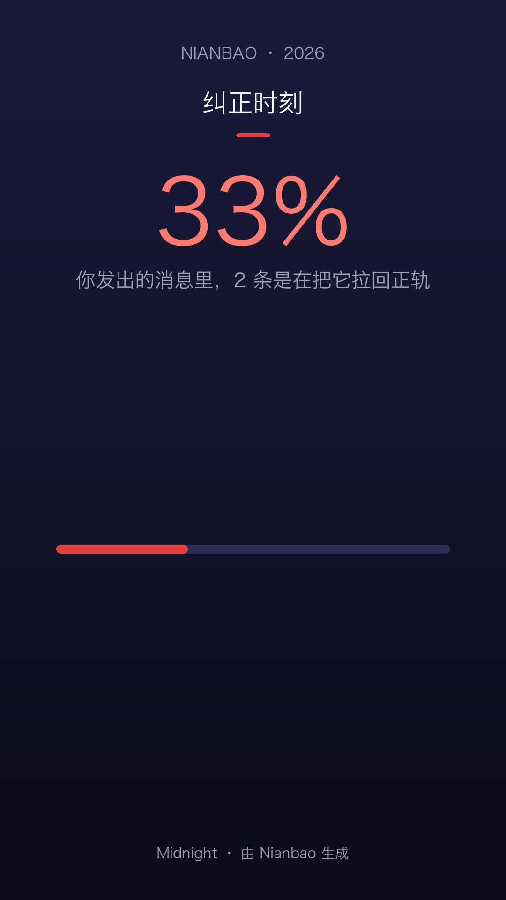
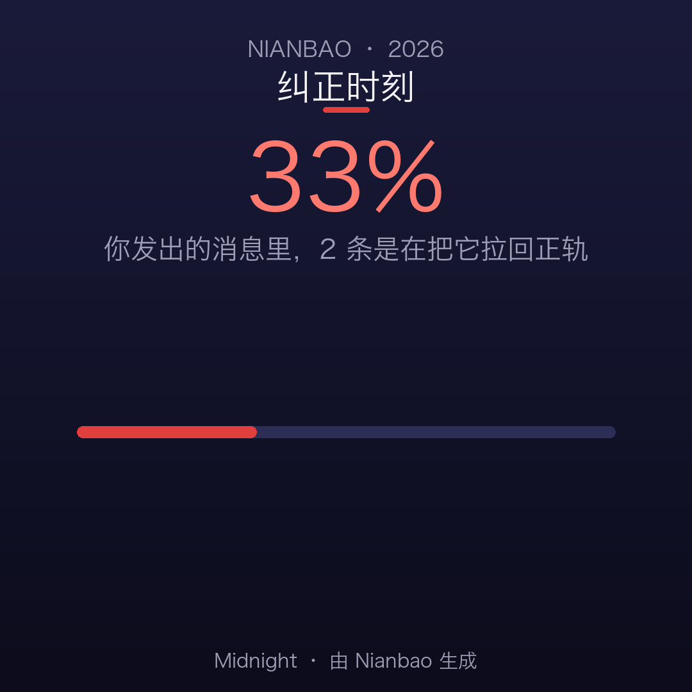

**English** | [简体中文](./README.md)

<div align="center">


# Nianbao · AI Collaboration Yearbook

A year of conversations with Claude Code and other coding agents sits untouched in your local logs. Nianbao digs through those session records, computes your correction rate, complaint heat and topic drift, and renders a shareable "AI collaboration yearbook".

[](https://github.com/SuperMarioYL/nianbao/actions/workflows/ci.yml)
[](https://github.com/SuperMarioYL/nianbao/releases)
[](https://www.python.org/)
[](./LICENSE)


<p>
  
  
</p>

<sub>Real render output · bundled sample data (<code>--demo</code>) · Midnight theme</sub>

</div>

---

##  Quickstart

Prerequisites: Python 3.12+ and [uv](https://docs.astral.sh/uv/).

```bash
# 30-second trial: bundled sample data, no local history needed
uvx nianbao --demo

# Run over your own history: reads ~/.claude/projects by default, strictly read-only
uvx nianbao
```

`nianbao` will: parse your logs (with a progress bar) → print the yearbook summary in your terminal → write 12 PNGs into `./nianbao-out/`.

Without uv: `pip install nianbao`, then `nianbao --demo`.
From source: `git clone https://github.com/SuperMarioYL/nianbao && cd nianbao`, then `uvx --from . nianbao --demo` (or `uv run nianbao --demo`).

Using logs from a different coding agent? Point `--logs-dir` at them — formats are auto-detected and can be mixed in one directory:

```bash
uvx nianbao --logs-dir ~/.zcode/cli/rollout   # ZCode / GLM CLI
```

##  Demo

Terminal recording (asciinema v2, about 3 seconds, real `nianbao --demo` output):

```bash
asciinema play assets/demo.cast
```

Recording file: [assets/demo.cast](assets/demo.cast) (opens in any [asciinema player](https://docs.asciinema.org/manual/player/))

Terminal output from the same run (bundled sample data):

```text
--demo：使用内置示例会话数据
解析会话日志 ━━━━━━━━━━━━━━━━━━━━━━━━━━━━━━━━━━━━━━━━ 1/1 0:00:00

╭────────────────────────────────╮
│ Nianbao · AI 协作年报          │
│ 2026-06-03 → 2026-06-03 · 1 天 │
╰────────────────────────────────╯

  会话   你发出的消息   助手回复   项目
 ───────────────────────────────────────
     1              6          8      1

╭──────────────────────────────────────────────────────────────────────────────╮
│ 33% 的消息是在纠正它 —— 2 次纠偏                                             │
╰──────────────────────────────────────────────────────────────────────────────╯
╭──────────────────────────────────────────────────────────────────────────────╮
│ 吐槽 1 次 · 火力最猛的一周 2026年6月 第1周（强度 3 · 1 条）                  │
╰──────────────────────────────────────────────────────────────────────────────╯

  项目         会话     首次出现     最近一次   存活
 ────────────────────────────────────────────────────
  api-server      1   2026-06-03   2026-06-03   0 天

 2026-06  文件 · 测试 · 路由 · app · flask · healthz · 他妈的 · 保留


╭───────────────────────────────────────────────────────╮
│ 6 张卡片 × 2 种比例已写入 nianbao-out（共 12 个 PNG） │
│ 预览：open nianbao-out                                │
╰───────────────────────────────────────────────────────╯
```

(The sample ships a single session; the TUI is Chinese-first. Run the same command over your own history and you get your numbers and your 12 cards. The two sample cards are at the top.)

##  What's in the yearbook

One run writes 6 cards × 2 aspect ratios (9:16 1080×1920 for full-screen posts; 1:1 1080×1080 for grid posts) — 12 PNGs into `./nianbao-out/`:

| Card | What it computes |
| --- | --- |
| Totals | Messages you typed, session count, project count |
| Corrections | Your correction rate — the share of messages like "不对 / 重新 / 我说的是 / not what I asked", with a progress bar |
| Complaint heat | Complaint count, a month × week heatmap, your worst week |
| Project survival | Project count, per-project session bars, the longest-lived project and its lifespan |
| Topic drift | Monthly keyword footprints (jieba TF-IDF) — where your topics wandered |
| Epilogue | The year in three numbers: corrections, complaints, messages |

Card copy ships in English and Chinese (`--lang zh | en`), with three themes (`--theme midnight | aurora | sunset`, see configuration below). Every card footer carries a "Made with Nianbao" attribution — when you post it, it speaks for itself.

##  Why Nianbao exists

A while back, an r/ClaudeAI user exported a year of their Claude Code history and counted by hand: 10,727 messages, 33% of them corrections or complaints, 895 of those serious (swearing, "I never asked for this"). Everyone is curious about that number, yet no product shows it to you:

- **Providers only show you the invoice.** Token usage, cost, rate limits — "33% of your messages were corrections" is a statistic that reflects badly on the model, so it will never appear in a provider's own year-in-review.
- **Monitoring tools answer a different question.** Real-time monitors like claude-hud or CodexBar ask "what am I burning right now?"; Nianbao asks "how did the agent and I actually work together this year?" One is a meter, the other a mirror — over the same logs.
- **Every curious person ends up writing their own script.** Once, badly, never maintained: JSONL formats differ per harness, there are no Chinese behavioral lexicons, and the output is a screenshot.

Nianbao turns that throwaway script into a maintained product: Chinese + English correction/complaint lexicons (severity-graded, auditable plain data), cross-harness log adapters, and a versioned card format. Fully offline, on your machine.

##  How it works

One offline Python process — no server, no network calls, no daemon:

```
~/.claude/projects/**/*.jsonl ─┐
~/.zcode/cli/rollout/*.jsonl  ─┼─▶ adapters (format sniffing) ─▶ SessionRecord[]
plain chat JSONL ({role,content})┘                              │
                                                    lexicons (zh + en)
                                                                ▼
                                        metrics + topics (jieba TF-IDF)
                                                                ▼
                                  YearbookReport (corrections / heat / survival / drift)
                                                                ▼
                                            cards + themes (Pillow rendering)
                                                                ▼
                                                    ./nianbao-out/ (12 PNGs)
```

Two owned primitives ([`schema.py`](src/nianbao/schema.py)):

- **`SessionRecord`** — the normalized behavioral projection of one session from any harness: user messages, corrections (negation / redo / clarify / revert), complaints (severity 1–3), topic keywords.
- **`CardSpec`** — binds one metric to a card layout and copy template, making the shareable yearbook card a versioned format asset instead of a one-off screenshot.

What counts as a "correction" or a "complaint" is defined entirely in the plain-data lexicons in [`lexicons.py`](src/nianbao/lexicons.py) — you can audit every term without reading code.

##  Supported log formats

| Format | Location | Notes |
| --- | --- | --- |
| Claude Code | `~/.claude/projects/**/*.jsonl` | Default directory; sidechain, meta, tool_result and harness-injected "pseudo-user" messages are filtered out |
| ZCode / GLM CLI | `~/.zcode/cli/rollout/model-io-sess_*.jsonl` | Deduplicated rebuild of the cumulative `request.messages` arrays; full / tail / delta windows are all stitched back into one session; subagent files are skipped |
| Plain chat JSONL | any directory | One `{role, content, timestamp?}` object per line, the common denominator of hand-rolled exports |

Formats are sniffed per file, and `--logs-dir` can point at a directory mixing all of them. Other CN harnesses (DeepSeek / Qwen CLI families) have not been verified one by one — if you have a sample, bring a redacted snippet to an [issue](https://github.com/SuperMarioYL/nianbao/issues).

##  Command line

| Command | What it does |
| --- | --- |
| `nianbao` | Full flow: parse → terminal summary → render cards |
| `nianbao summary` | Print the terminal summary only |
| `nianbao cards` | Render the PNG card set only |

| Option | Default | Description |
| --- | --- | --- |
| `--logs-dir` | `~/.claude/projects` | Session log directory; formats auto-detected, mixable |
| `--lang` | `zh` | Card copy language: `zh` / `en` |
| `--theme` | `midnight` | Card palette: `midnight` / `aurora` / `sunset` |
| `--font` | auto | Explicit CJK font file (.ttf / .ttc), overriding the built-in chain |
| `--out-dir` | `./nianbao-out` | Card output directory |
| `--demo` | off | Run the full flow over bundled sample data |

##  Configuration and limits

- **Fonts**: on macOS the renderer picks Hiragino Sans GB / STHeiti automatically. Linux and containers usually lack them — pass `--font /path/to/NotoSansCJK-Regular.ttc`; when no font loads, the error lists every path tried and how to fix it.
- **Reporting period**: the yearbook spans the earliest to the latest message actually present in your logs, not a calendar year — two months of history gets you a two-month yearbook.
- **Languages**: card copy is `zh` / `en` only for now; the correction/complaint lexicons match both languages simultaneously, so mixed-language sessions are measured correctly.
- **Not in v0.1**: real-time token/cost/rate monitoring; web UI or hosted service; card languages beyond zh/en.

##  Privacy

- **Zero network calls.** Parsing, statistics and rendering all happen on your machine — there is not a single HTTP call in the codebase, no telemetry, no accounts.
- Logs are **read-only**. A card leaves your machine only when you post it.
- Every detection rule is a plain-data term list in [`lexicons.py`](src/nianbao/lexicons.py) — open the file and check every term.

##  Pricing

The personal edition (everything in v0.1) is free and open source. The commercial product is not on the personal side — it is on the team side:

| Tier | Price | What you get |
| --- | --- | --- |
| Personal · current | Free, open source (MIT) | All local features: parsing, metrics, 12 cards, 3 themes, zh/en |
| **Team yearbook · pilot** | ¥2,999 / team / year (first 3 design partners, ~$399) | Members run `nianbao` locally and export YearbookReport JSON; you get a merged team/project yearbook: correction rate by project, adoption heatmap, session totals. Manual pilot, 48-hour turnaround |
| Team yearbook · self-serve | ¥4,999 / team / year (after pilot) | Same, self-serve flow |
| Theme packs | ¥19.9 (from v0.2) | Paid card themes |

Why teams pay: after a team lead sees a member's personal card, what they want is the cross-team view — which projects keep reworking, where agent usage concentrates. That aggregation layer is exactly what v0.1 deliberately leaves out, and the first commercial feature of v0.2.

To become a design partner: open an [issue](https://github.com/SuperMarioYL/nianbao/issues) with "team yearbook pilot" in the title.

##  Roadmap

- [x] **v0.1 (current)** — Claude Code / ZCode (GLM) / plain chat JSONL parsing; rich TUI summary; 6 cards × 2 ratios; zh/en copy; 3 themes; fully offline
- [ ] **v0.2** — team yearbook (pilot → self-serve); paid theme packs; more harness adapters (bring a redacted sample log to an issue)
- [ ] **Later** — multi-year comparison timeline

Not planned: a web UI, real-time usage monitoring, or uploading your logs to any server.

##  License

[MIT](./LICENSE) © 2026 SuperMarioYL

---

<p align="center"><sub><a href="./LICENSE">MIT</a> © 2026 SuperMarioYL</sub></p>
